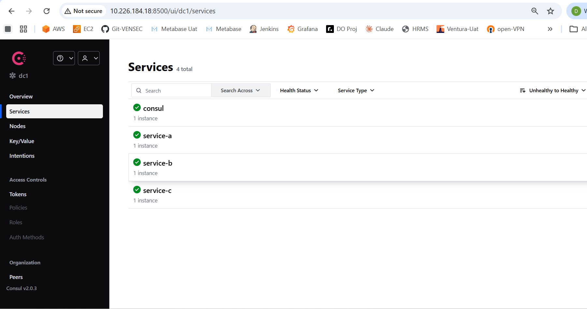
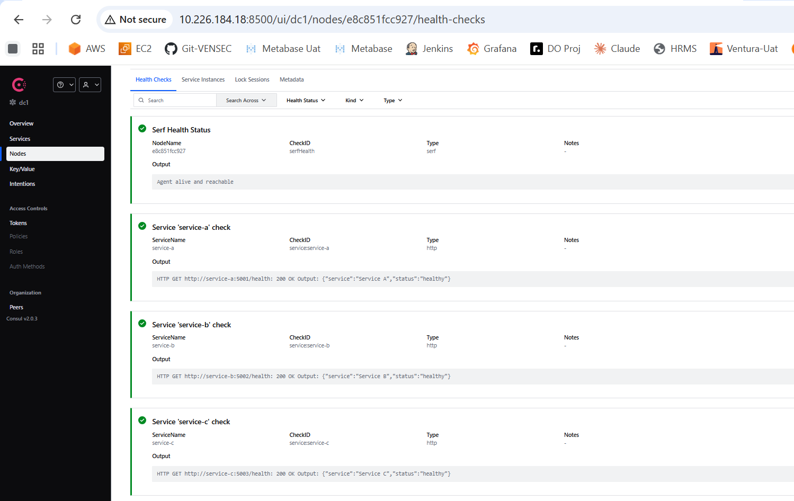
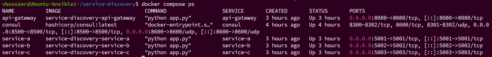
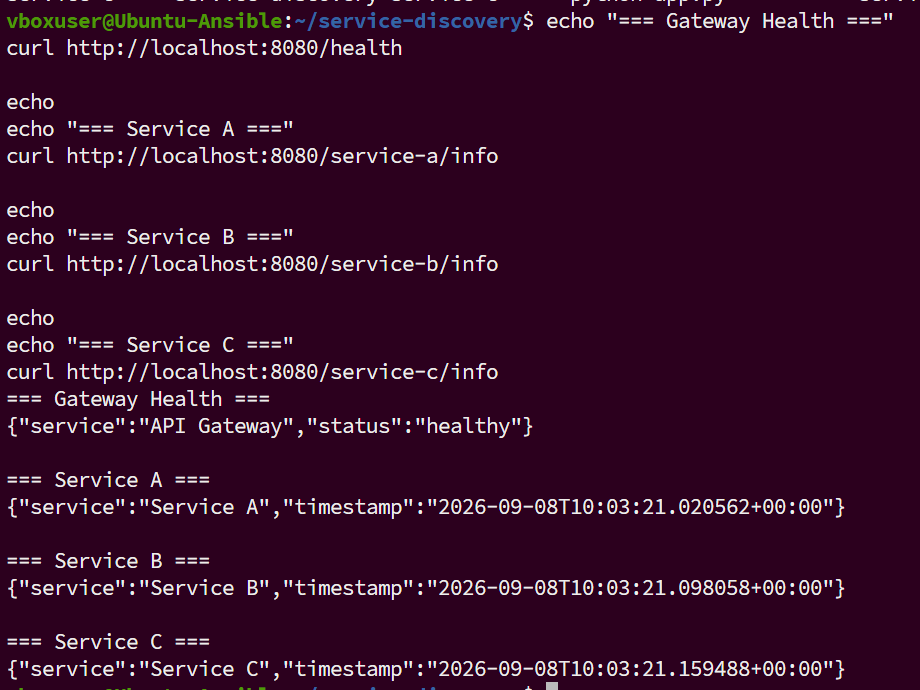
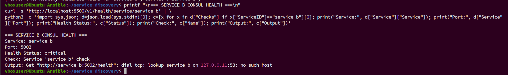
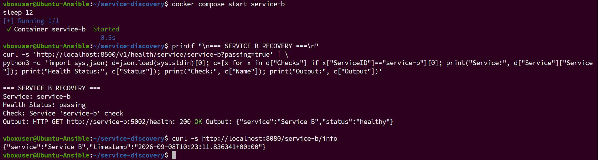
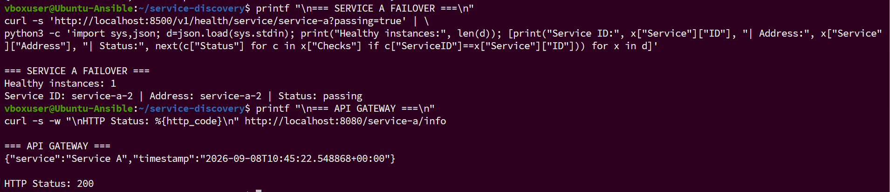

# Service Discovery with Consul, Docker Compose and API Gateway

## Project Overview

This project demonstrates how service discovery works in a microservices
architecture using:

-   HashiCorp Consul
-   Docker and Docker Compose
-   Python Flask microservices
-   API Gateway
-   Consul health checks
-   Dynamic service discovery
-   Failure detection and failover

The project contains three dummy services registered with Consul. The
API Gateway discovers healthy service instances from Consul and forwards
client requests to them.

------------------------------------------------------------------------

## Architecture

``` text
Client
   |
   v
API Gateway :8080
   |
   v
Consul :8500
   |
   +---- Service A :5001
   |
   +---- Service B :5002
   |
   +---- Service C :5003
```

### Components

  Component       Port Responsibility
  ------------- ------ ----------------------------------------
  Consul          8500 Service registry and health monitoring
  API Gateway     8080 Receives requests and forwards them
  Service A       5001 Dummy backend service
  Service B       5002 Dummy backend service
  Service C       5003 Dummy backend service

------------------------------------------------------------------------

## Hotel Analogy

A simple analogy to understand service discovery:

-   **Services** are hotel departments.
-   **API Gateway** is the reception desk.
-   **Consul** is the hotel address book.
-   When a client asks for a department, the reception asks the address
    book for a healthy department instance.
-   If one department instance is unavailable, Consul removes it from
    healthy results.

------------------------------------------------------------------------

## Technologies Used

-   Ubuntu Linux
-   Docker
-   Docker Compose
-   Python 3.12
-   Flask
-   Python Requests
-   HashiCorp Consul
-   REST APIs
-   Health checks

------------------------------------------------------------------------

## Project Structure

``` text
service-discovery/
├── api-gateway/
│   ├── app.py
│   ├── requirements.txt
│   └── Dockerfile
├── service-a/
│   ├── app.py
│   ├── requirements.txt
│   └── Dockerfile
├── service-b/
│   ├── app.py
│   ├── requirements.txt
│   └── Dockerfile
├── service-c/
│   ├── app.py
│   ├── requirements.txt
│   └── Dockerfile
├── screenshots/
│   ├── 01-consul-services.png
│   ├── 02-service-a-health.png
│   ├── 03-docker-compose.png
│   ├── 04-api-gateway-test.png
│   ├── 05-service-b-failure.png
│   ├── 06-service-b-recovery.png
│   └── 07-service-a-failover.png
├── docker-compose.yml
├── .gitignore
└── README.md
```

------------------------------------------------------------------------

## Prerequisites

Make sure Docker and Docker Compose are installed.

Verify:

``` bash
docker --version
docker compose version
```

------------------------------------------------------------------------

## Start the Project

Go to the project directory:

``` bash
cd ~/service-discovery
```

Build and start all services:

``` bash
docker compose up -d --build
```

Check running containers:

``` bash
docker compose ps
```

Expected services:

``` text
api-gateway
consul
service-a
service-b
service-c
```

------------------------------------------------------------------------

## Open Consul UI

Open the following URL in a browser:

``` text
http://localhost:8500
```

If accessing from another machine, use the Ubuntu VM IP:

``` text
http://<UBUNTU_VM_IP>:8500
```

The Consul UI should show:

``` text
service-a
service-b
service-c
consul
```

------------------------------------------------------------------------

## How Service Registration Works

Each service registers itself with Consul during application startup.

Example registration:

``` python
registration = {
    "ID": SERVICE_ID,
    "Name": SERVICE_NAME,
    "Address": SERVICE_ADDRESS,
    "Port": SERVICE_PORT,
    "Check": {
        "HTTP": f"http://{SERVICE_ADDRESS}:{SERVICE_PORT}/health",
        "Interval": "10s",
        "Timeout": "5s"
    }
}
```

The service sends this registration to:

``` text
/v1/agent/service/register
```

Consul stores:

-   Service name
-   Service ID
-   Service address
-   Service port
-   Health check configuration

------------------------------------------------------------------------

## Health Check

Each service exposes a health endpoint:

``` text
GET /health
```

Example:

``` bash
curl http://localhost:5001/health
```

Expected response:

``` json
{
  "service": "Service A",
  "status": "healthy"
}
```

Consul periodically calls the configured health endpoint.

A healthy service returns:

``` text
HTTP 200 OK
```

If the service becomes unavailable, Consul marks the health check as:

``` text
critical
```

------------------------------------------------------------------------

## API Gateway Endpoints

The API Gateway runs on port `8080`.

### Gateway Health

``` bash
curl http://localhost:8080/health
```

### Service A

``` bash
curl http://localhost:8080/service-a/info
```

### Service B

``` bash
curl http://localhost:8080/service-b/info
```

### Service C

``` bash
curl http://localhost:8080/service-c/info
```

The Gateway queries Consul using:

``` text
/v1/health/service/<service-name>?passing=true
```

Only healthy instances are returned.

------------------------------------------------------------------------

## Complete Functional Test

Run:

``` bash
echo "=== Gateway Health ==="
curl http://localhost:8080/health

echo
echo "=== Service A ==="
curl http://localhost:8080/service-a/info

echo
echo "=== Service B ==="
curl http://localhost:8080/service-b/info

echo
echo "=== Service C ==="
curl http://localhost:8080/service-c/info
```

Expected result:

``` text
Gateway Health → healthy
Service A      → successful response
Service B      → successful response
Service C      → successful response
```

------------------------------------------------------------------------

## Consul CLI/API Verification

List all registered services:

``` bash
curl -s http://localhost:8500/v1/catalog/services | python3 -m json.tool
```

Check Service A health:

``` bash
curl -s 'http://localhost:8500/v1/health/service/service-a' | python3 -m json.tool
```

Check only passing Service A instances:

``` bash
curl -s 'http://localhost:8500/v1/health/service/service-a?passing=true' | python3 -m json.tool
```

------------------------------------------------------------------------

## Failure Detection Test

Stop Service B:

``` bash
docker compose stop service-b
```

Wait for the health check interval:

``` bash
sleep 12
```

Check Service B health:

``` bash
curl -s 'http://localhost:8500/v1/health/service/service-b' | python3 -m json.tool
```

Consul should show a failed or critical service check.

Now test the Gateway:

``` bash
curl -i http://localhost:8080/service-b/info
```

Since there is no healthy Service B instance, the Gateway returns an
error response, generally HTTP `503`.

This proves that Consul detects service failure.

------------------------------------------------------------------------

## Service Recovery Test

Start Service B again:

``` bash
docker compose start service-b
```

Wait:

``` bash
sleep 12
```

Check passing instances:

``` bash
curl -s 'http://localhost:8500/v1/health/service/service-b?passing=true' | python3 -m json.tool
```

Test the Gateway:

``` bash
curl http://localhost:8080/service-b/info
```

The request should succeed again.

------------------------------------------------------------------------

## Multiple Service Instances

A second Service A instance can be started manually:

``` bash
docker run -d \
  --name service-a-2 \
  --network service-discovery_service-network \
  --ip 172.19.0.10 \
  -e CONSUL_URL=http://consul:8500 \
  -e SERVICE_ID=service-a-2 \
  -e SERVICE_ADDRESS=172.19.0.10 \
  service-discovery-service-a:latest
```

Check both instances:

``` bash
curl -s 'http://localhost:8500/v1/health/service/service-a?passing=true' | python3 -m json.tool
```

Consul should show:

``` text
service-a
service-a-2
```

Both instances have the same logical service name:

``` text
service-a
```

but different unique IDs.

------------------------------------------------------------------------

## Dynamic Discovery and Failover Test

Stop the original Service A instance:

``` bash
docker compose stop service-a
```

Wait:

``` bash
sleep 12
```

Check healthy instances:

``` bash
curl -s 'http://localhost:8500/v1/health/service/service-a?passing=true' | python3 -m json.tool
```

Only `service-a-2` should remain healthy.

Now call the Gateway:

``` bash
curl http://localhost:8080/service-a/info
```

The request should still succeed because the Gateway discovers the
remaining healthy instance through Consul.

This demonstrates:

``` text
Service A instance 1 stops
        |
        v
Consul marks it unhealthy
        |
        v
Gateway queries healthy instances
        |
        v
Gateway uses service-a-2
        |
        v
Request succeeds
```

------------------------------------------------------------------------

## Cleanup After Failover Test

Start the original Service A:

``` bash
docker compose start service-a
```

Wait:

``` bash
sleep 12
```

Remove the temporary instance:

``` bash
docker rm -f service-a-2
```

Check final state:

``` bash
docker compose ps
```

------------------------------------------------------------------------

## Important Learning Point: Stale Registration

If a manually created container is deleted without deregistering it from
Consul, its registration may remain in Consul.

To remove a stale registration:

``` bash
curl -X PUT \
  http://localhost:8500/v1/agent/service/deregister/service-a-2
```

Then verify:

``` bash
curl -s 'http://localhost:8500/v1/health/service/service-a' | python3 -m json.tool
```

------------------------------------------------------------------------

## Useful Docker Commands

View all containers:

``` bash
docker ps
```

View Compose services:

``` bash
docker compose ps
```

View logs:

``` bash
docker compose logs -f service-a
docker compose logs -f service-b
docker compose logs -f service-c
docker compose logs -f api-gateway
docker compose logs -f consul
```

Restart all services:

``` bash
docker compose restart
```

Stop all services:

``` bash
docker compose down
```

Rebuild everything:

``` bash
docker compose up -d --build
```

------------------------------------------------------------------------

## Useful Consul Commands

List services:

``` bash
curl -s http://localhost:8500/v1/catalog/services | python3 -m json.tool
```

Check service health:

``` bash
curl -s 'http://localhost:8500/v1/health/service/service-a' | python3 -m json.tool
```

Check only healthy instances:

``` bash
curl -s 'http://localhost:8500/v1/health/service/service-a?passing=true' | python3 -m json.tool
```

Deregister a service:

``` bash
curl -X PUT http://localhost:8500/v1/agent/service/deregister/<SERVICE_ID>
```

------------------------------------------------------------------------

## Screenshots

The project screenshots are stored in the `screenshots/` directory.

Recommended screenshots:

1.  `01-consul-services.png` --- All services visible in Consul UI
2.  `02-service-a-health.png` --- Service A health checks passing
3.  `03-docker-compose.png` --- All Docker Compose containers running
4.  `04-api-gateway-test.png` --- Gateway and all service responses
5.  `05-service-b-failure.png` --- Consul detecting Service B failure
6.  `06-service-b-recovery.png` --- Service B becoming healthy again
7.  `07-service-a-failover.png` --- Gateway working through the second
    Service A instance

Add screenshots using Markdown:

``` markdown







```

------------------------------------------------------------------------

## Limitations of This Demo

-   The API Gateway currently selects the first healthy instance
    returned by Consul.
-   It demonstrates service discovery and failover, not full round-robin
    load balancing.
-   Fixed IP assignment in the manual multi-instance test is intended
    only for this learning demonstration.
-   In production, service registration, deregistration, retries,
    timeouts, and load balancing should be handled more robustly.

------------------------------------------------------------------------

## Key Concepts Demonstrated

-   Service registration
-   Service discovery
-   Service health checks
-   Healthy instance filtering
-   API Gateway routing
-   Failure detection
-   Service recovery
-   Multiple service instances
-   Dynamic discovery
-   Basic failover
-   Container networking
-   REST-based Consul API

------------------------------------------------------------------------

## Conclusion

This project demonstrates how microservices can dynamically register
themselves with Consul and how an API Gateway can discover healthy
service instances without hardcoding backend addresses.

The project also validates that:

-   Services register automatically
-   Consul monitors service health
-   Failed services are marked unhealthy
-   Recovered services become healthy again
-   The Gateway can route requests dynamically
-   Traffic can continue through another healthy instance during
    failover


## Screenshots

The project screenshots are stored in the `screenshot/` directory.

### 1. Consul Services


This screenshot shows all services registered in Consul.

### 2. Service A Health


This screenshot shows Service A health checks passing in Consul.

### 3. Docker Compose


This screenshot shows all Docker Compose containers running successfully.

### 4. API Gateway Test


This screenshot shows the API Gateway health endpoint and responses from Service A, Service B, and Service C.

### 5. Service B Failure


This screenshot demonstrates Consul detecting Service B as unhealthy after the container is stopped.

### 6. Service B Recovery


This screenshot demonstrates Service B becoming healthy again after restarting the container.

### 7. Service A Failover



This screenshot demonstrates dynamic service discovery and failover through the second Service A instance.

> Note: The directory name is intentionally `screenshot/` because that is the directory currently used in this GitHub repository.
